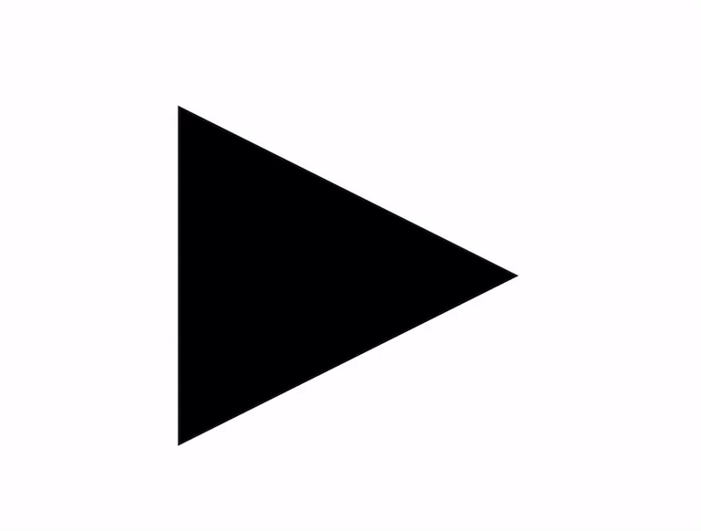
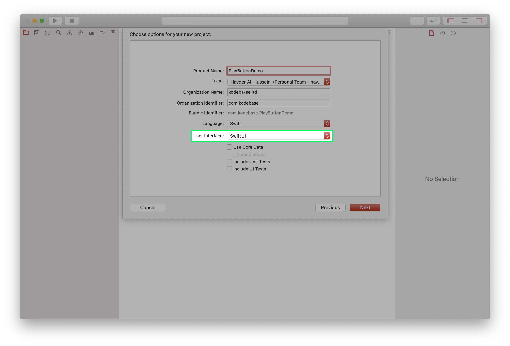
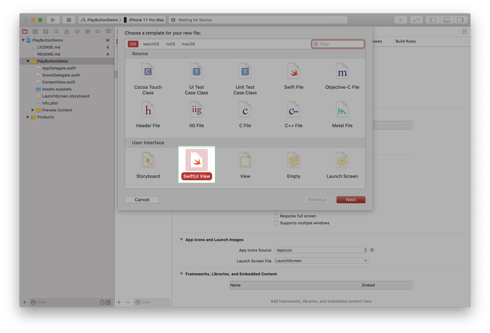
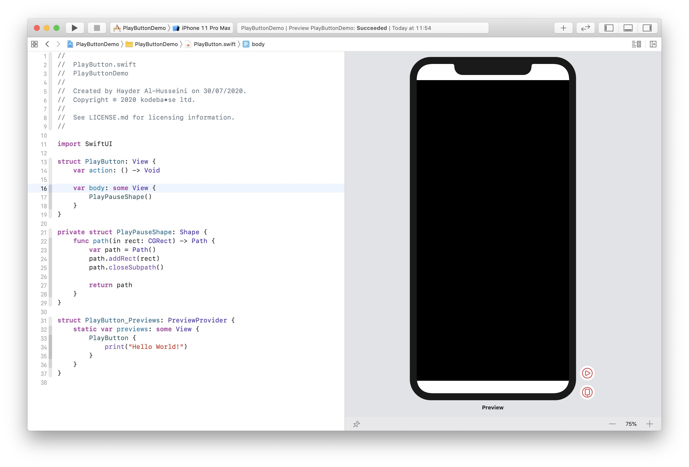
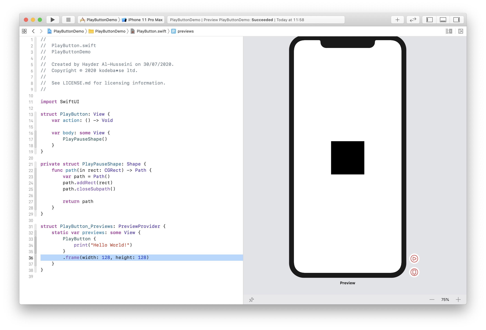
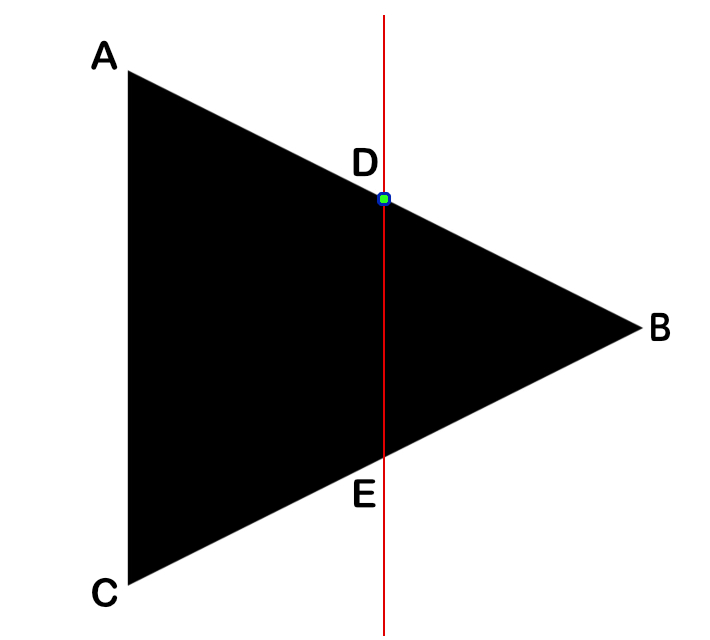
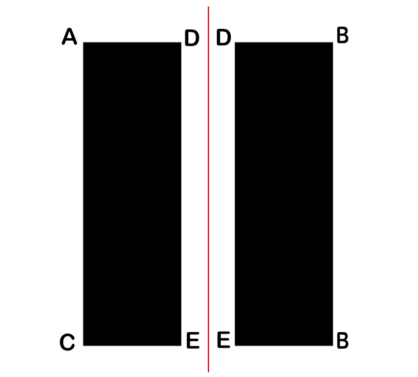

## Anatomy of the Netflix Play Button.
Developing an animated button with SwiftUI.

We will develop a play pause button similar to the one the Netflix video player. And just like Swift has replaced Objective-C as the default development language for iOS, the same will apply to SwiftUI and UIKit soon enough. Therefore we will be using SwiftUI to develop our button.

## PlayButton.swift
Create a new Xcode project, using the iOS *Single View Application* template. Let's call it *PlayButtonDemo*. In the next screen, make sure to select **SwiftUI** in the drop down menu titled *User Interface*.  

Create a new **User Interface** file, select the **SwiftUI View** option. Call it **PlayButton**.

In **PlayButton.swift** add an `action` property to the `PlayButton` struct, that takes a closure as it's value. This will be the *action* the button performs when tapped.

        var action: () -> Void

`PlayButton_Preview` will throw a "Missing Argument…" error. Fix it by supplying the `action` argument. We will set a simple action that prints *Hello World!*.

    struct PlayButton_Previews: PreviewProvider {
        static var previews: some View {
            PlayButton {
                print("Hello Button")
            }
        }
    }

At the end of `PlayButton`, create a new `Shape` struct, called `PlayPauseShape`.

    private struct PlayPauseShape: Shape {
        func path(in rect: CGRect) -> Path {
            var path = Path()
            
            path.addRect(rect)
            path.closeSubpath()
            
            return path
        }
    }

This creates a rectangular shape using the supplied `rect` parameter for dimensions.  
Back in `PlayButton`, change the default `Text("Hello, World!")` to `PlayPauseShape()`. Our *Canvas* will look like this.

We clearly don't intend to use a button that big. Let's set a more appropriate size for our button.

In `PlayButton_Previews` add a `frame` modifier to `PlayButton`.

    struct PlayButton_Previews: PreviewProvider {
        static var previews: some View {
            PlayButton {
                print("Hello World!")
            }
            .frame(width: 128, height: 128)
        }
    }

Before we start creating the shape, let's complete `PlayButton`'s construction, by making the button accessible and adding a tap gesture recognizer to it.  

    struct PlayButton: View {
        @State private var isPlaying = false
        
        var action: () -> Void
        
        var body: some View {
            PlayPauseShape(isPlaying: isPlaying)
                .accessibility(label: isPlaying ? Text("Pause") : Text("Play"))
                .accessibility(addTraits: .isButton)
                .accessibilityAction { self.performTap() }
                .animation(.easeInOut(duration: 0.3))
                .contentShape(Rectangle())
                .onTapGesture { self.performTap() }
        }
        
        private func performTap() {
            isPlaying.toggle()
            action()
        }
    }

With regards to accessibility, when video is playing on device, the **Pause** button is what a user will see. Likewise, when video is paused, the user will see the **Play** button. Hence VoiceOver will report exactly what the button looks like.  
The `.isButton` accessibility trait, informs VoiceOver that it should report this UI element as a button. And finally, when the user double taps the element while it's in focus, VoiceOver will perform `performTap()`, the same function that our tap gesture recognizer calls.  
`performTap()` toggles the button's internal state, from pause to play and vice verca, and then calls the action that is passed in when setting up the button in its parent view.  
The `.contentShape(Rectangle)` modifier informs **SwiftUI** that the button's content has a rectangular shape, making the whole area tappable. Without this modifier, the **SwiftUI** will mask the button's tappable hit area to the shape of our play/pause shape.  
With our type complete, let us turn our attention to the shape.

## PlayPauseShape

We want to split a triangle in half, we want each half to morph into a rectangle. The first challange would be to find the point D in the image below, the intersection of the triangle's top edge with the line running across its centre.  
  
It's actually quite simple, all we need to do is, find the equation of the line using two points A (`0`, `0`) and B (`width`, `height * 0.5`).  
First we find the slope M,  
M = (By - Ay)/(Bx - Ax) => M = (`height * 0.5`)/`width`  
We know that D = (`width * 0.5`, Dy)  
Substitue D with either A or B into the slope equation will get us the following:  
Dy = M(Dx - Ax) + Ay =>  Dy = (`height * 0.5`)/`width` * (`width * 0.5`)  
With regards to E, since the play shape is an [equilateral triangle](https://en.wikipedia.org/wiki/Equilateral_triangle) (the angles inside the triangle are all the same)  
Ey = `height` - Dy.  
We will use a Path to draw the two halves, each half will be a subpath of the main path, and now that we've solved for all the unknowns (`width` and `height` are supplied to us by Shape's `path(in:)`) the first subpath will have the following points (A, D, E, C) and our second subpath will have (D, B, B, E). The duplicate B is not an error, we are animating from a triangle to a rectangular shape, it's better to just collpase the point onto it's self when it's a triangle.  
With regards to the pause shape, we provide each subpath with a rectangle that is offset from the center of the shape.

In **UIKit**, animating between two paths was very easy using `CABasicAnimation`. In SwiftUI in not as straight forward. We need to provide a parameter to SwiftUI for interpolation. So if we wanted to animate from 0 to 1, SwiftUI will provide us with (0.0, 0.1, 0.2 ... 1.0). We inform SwiftUI of the parameter by implementing the `animateableData` property on types that conform to `Animateable`. Hence that parameter needs to be part of the path for the animation to take effect.

> For a great write on SwiftUI animation, checkout out [https://swiftui-lab.com/swiftui-animations-part1/](this post).

We'll go through how to animate from the play shape's A point to pause shape's A point. We define the two points `leftPlayTopLeft` and `leftPauseTopLeft`. We find out how far the point has to move  from pause's top left to play's top left. Mutliplying the result by the interpolation value and adding to `leftPauseTopLeft` will animate between to the two shapes.

        let leftPauseTopLeft = CGPoint(x: ((width * 0.5) - pauseBarWidth) * 0.5, y: 0.0)
        let leftPlayTopLeft = CGPoint.zero
        let leftDeltaTopLeft = CGPoint(x:pauseTopLeft.x - leftPlayTopLeft.x, y: pauseTopLeft.y - leftPlayTopLeft.y)
        let topLeftPoint = CGPoint(x: leftPlayTopLeft.x + (deltaTopLeft.x * t), y: leftPlayTopLeft.y + (deltaTopLeft.y * shift))

        path.addLine(to: topLeftPoint)

Back to **PlayButton.swift**, we will now define all 8 points as described above in a function called pathPoints. The value that is being interpolated her is the `shift` property.  

        private func pathPoints(width: CGFloat, height: CGFloat) -> [[CGPoint]] {
            var points: [[CGPoint]] = [[]]
            var left: [CGPoint] = []
            var right: [CGPoint] = []
            let pauseBarWidth = width * barWidthFraction
            
            // Slope for top play line
            let m = (height * 0.5)/width
            
            // Y at the center of the play line
            let centerY = (width * 0.5 * m) - (height * 0.5)

            // Left side
            // Top left
            let leftPauseTopLeft = CGPoint(x: ((width * 0.5) - pauseBarWidth) * 0.5, y: 0.0)
            let leftPlayTopLeft = CGPoint.zero
            let leftDeltaTopLeft = leftPauseTopLeft - leftPlayTopLeft
            left.append(leftPlayTopLeft + (leftDeltaTopLeft * shift))
            
            // Top Right
            let leftPauseTopRight = CGPoint(x:leftPauseTopLeft.x + pauseBarWidth, y: 0.0)
            let leftPlayTopRight = CGPoint(x: width * 0.5, y: -centerY)
            let leftDeltaTopRight = leftPlayTopRight - leftPauseTopRight
            left.append(leftPlayTopRight - (leftDeltaTopRight * shift))

            // Bottom Right
            let leftPauseBottomRight = CGPoint(x: leftPauseTopRight.x, y: height)
            let leftPlayBottomRight = CGPoint(x: width * 0.5, y: height + centerY)
            let leftDeltaBottomRight = leftPlayBottomRight - leftPauseBottomRight
            left.append(leftPlayBottomRight - (leftDeltaBottomRight * shift))
            
            // Bottom Left
            let leftPauseBottomLeft = CGPoint(x: (width * 0.5 - pauseBarWidth) * 0.5, y: height)
            let leftPlayBottomLeft = CGPoint(x: 0.0, y: height)
            let leftDeltaBottomLeft = leftPlayBottomLeft - leftPauseBottomLeft
            left.append(leftPlayBottomLeft - (leftDeltaBottomLeft * shift))
                
            points.append(left)
            
            // Right side
            // Top Left
            let rightPauseTopLeft = CGPoint(x: leftPauseTopLeft.x + width * 0.5, y: leftPauseTopLeft.y)
            let rightPlayTopLeft = CGPoint(x: width * 0.5, y: -centerY)
            let rightDeltaTopLeft = rightPlayTopLeft - rightPauseTopLeft
            right.append( rightPlayTopLeft - (rightDeltaTopLeft * shift))
            
            // Top Right
            let rightPauseTopRight = CGPoint(x: rightPauseTopLeft.x + pauseBarWidth, y: rightPauseTopLeft.y)
            let rightPlayTopRight = CGPoint(x: width, y: height * 0.5)
            let rightDeltaTopRight = rightPlayTopRight - rightPauseTopRight
            right.append( rightPlayTopRight - (rightDeltaTopRight * shift))
            
            // Bottom Right
            let rightPauseBottomRight = CGPoint(x: rightPauseTopRight.x, y: height)
            let rightPlayBottomRight = rightPlayTopRight
            let rightDeltaBottomRight = rightPlayBottomRight - rightPauseBottomRight
            right.append( rightPlayBottomRight - (rightDeltaBottomRight * shift))
            
            // Bottom Left
            let rightPauseBottomLeft = CGPoint(x: rightPauseTopLeft.x, y: height)
            let rightPlayBottomLeft = CGPoint(x: rightPlayTopLeft.x, y: height + centerY)
            let rightDeltaBottomLeft = rightPlayBottomLeft - rightPauseBottomLeft
            right.append(rightPlayBottomLeft - (rightDeltaBottomLeft * shift))
            
            points.append(right)
            
            return points
        }

`pathPoints(width:height)` returns an array that's holding two arrays. The first array contains all the points for the left subpath, while the second array provides the points for the right subpath.  
We update `path(in:)` to loop through the arrays and draw the lines.

    func path(in rect: CGRect) -> Path {
        var path = Path()
        let allPoints = self.pathPoints(width: rect.size.width,
                                        height: rect.size.height)
                
        for points in allPoints {
            guard let startPoint = points.first else {
                continue
            }
            path.move(to: startPoint)
            
            for i in 1..<points.count {
                let point = points[i]
                path.addLine(to: point)
            }
            
            path.closeSubpath()
        }
        return path
    }

Click the **Live Preview** button in the canvas and tap away, you should get the button behaving as below.

